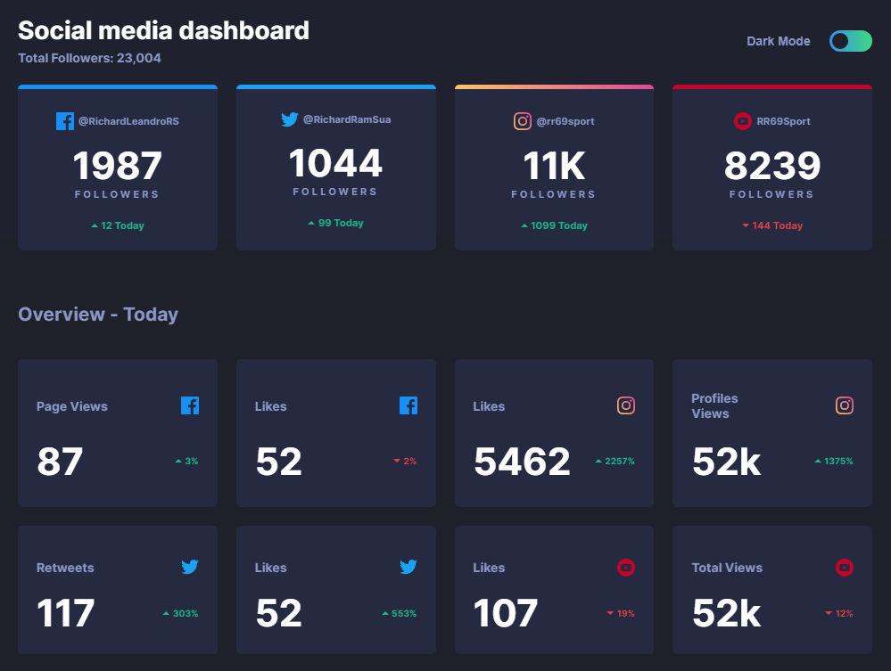

# Frontend Mentor - Social media dashboard with theme switcher

[Link to challenge](https://www.frontendmentor.io/solutions/social-media-dashboard-with-theme-switcher-xz1UqwEkK) | [Demo](https://frontendmentor-challenge-repos.github.io/social-media-dashboard-with-theme-switcher/)

## Built With

- Semantic HTML5 markup
- CSS custom properties
- Flexbox
- CSS Grid
- Mobile-first workflow
- [Sass](https://sass-lang.com/)
- [Gulp](https://gulpjs.com/)

## Author

- Frontendmentor - [rr69sport](https://www.frontendmentor.io/profile/rr69sport)
- LinkedIn - [Richard Ramírez](https://www.linkedin.com/in/richard-ramírez-514963181/)
- GitHub - [rr69sport](https://github.com/rr69sport)

